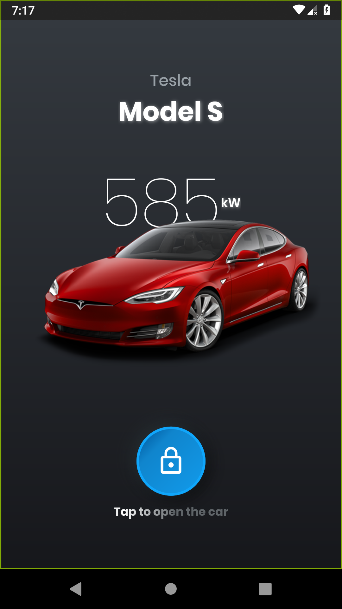
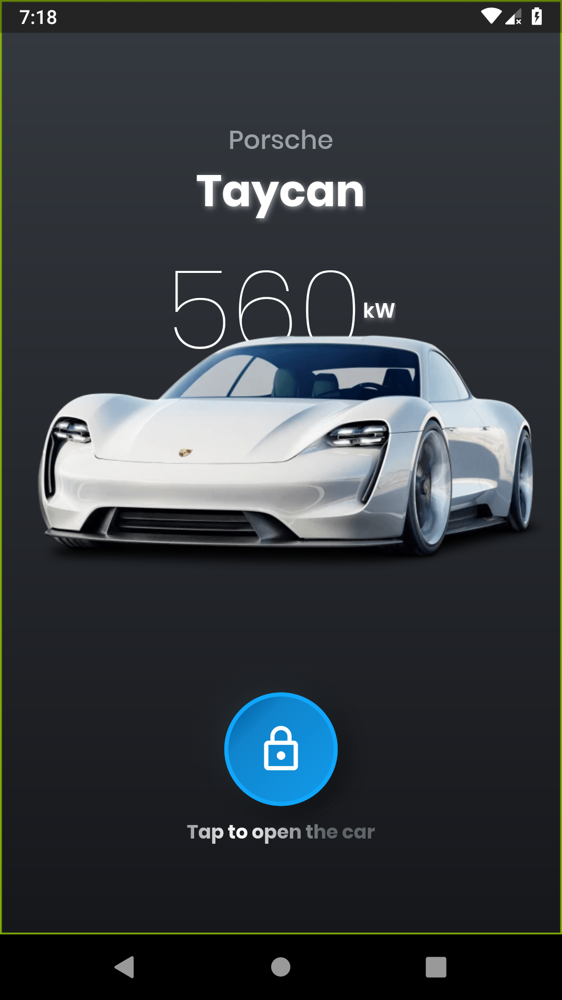

# maquetteig2i

A new Flutter application.

This app allows you to control an esp32 (which is connected to a/few
motor(s) for example).

# The home page

You can choose the car that you want (each car corresponds to a BLE
device).

# The connection page

Once you've chosen a car, the app will try to connect to the BLE device
which is called like the car (if you choose the Model S, you're BLE
device needs to be called like this). You can view all the different
states of connection on this page.

# The interact page

Once the device is connected, you can interact with it and set few
values directly inside the app.
